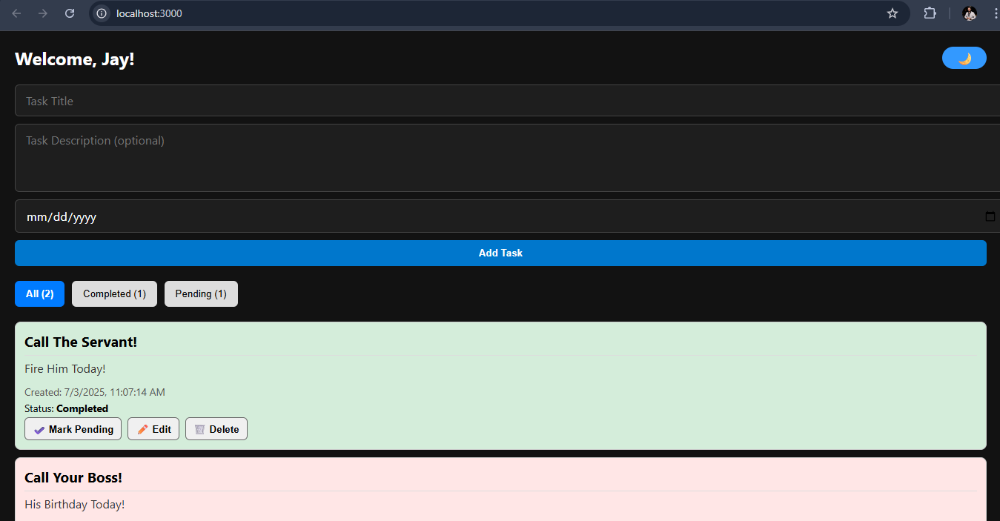
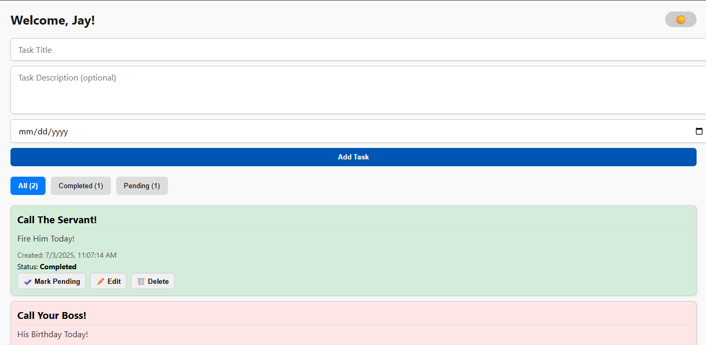

# 📝 Personal Task Tracker

## 📖 Description
A simple personal task management app built with React. Users can login, add/edit/delete tasks, and filter them by status. It supports Dark Mode and saves data using localStorage.

## 🚀 Features
- 🔐 Simple Login (localStorage)
- 📝 Add, Edit, Delete tasks
- ✅ Mark tasks as Completed or Pending
- 🔎 Filter tasks: All / Completed / Pending
- 🌙 Toggle Dark Mode
- 💾 Data stored using localStorage
- 📱 Responsive Design

## 🔗 Live Demo
[Click to view the deployed app](https://funny-duckanoo-25cfaa.netlify.app/)

## 🛠️ Installation

To run locally:

```bash
git clone https://github.com/jayjadhav114/task-tracker.git
cd task-tracker
npm install
npm start

###  Screenshots

###  Light mode


###  Dark mode

